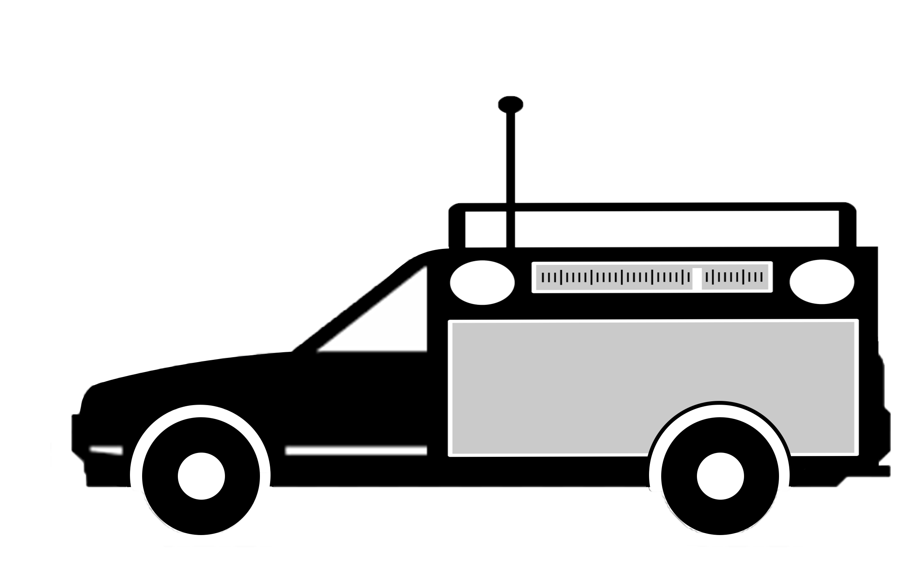

<h1 align="center">Engineering Addendum</h1>

<b>C-V2X Misbehavior Detection System</b>

<b>Team 13</b>

Michael Aliberti

Max Ellsworth

Jason  Inirio

Sam Krasnoff

Julia Zeng

Yixiu Zhu

 

## Navigation

<!-- TABLE OF CONTENTS -->

  
Table of Contents

  <ol>
    <li>
      <a href="#engineering-addendum">Title</a>
    </li>
    <li>
      <a href="#project-overview">Project Overview</a>
    </li>
    <li>
      <a href="#current-status">Current Status</a>
    </li>
    <li>
      <a href="#potential-pitfalls">Potential Pitfalls</a>
    </li>
  </ol>

 

## Project Overview

This is the overview

 

(<a href="#navigation">to table of contents</a>)

## Repositories

This project leverages multiple different repositories within the <a href="https://github.com/C-V2X-Senior-Design">C-V2X Senior Design Github Organization</a>. These include modified forks of existing radio software repositories, original repositories for machine learning model generation, and even a repository for discussing and tracking outstanding tasks.

All repositories used throughout the project's lifecycle are listed below.

* <a href="https://github.com/C-V2X-Senior-Design/CV2X_MachineLearning">C-V2X Machine Learning</a>
  * A python based machine-learning suite designed to generate and evaluate misbehavior-detection models trained on resource block allocation data

* <a href="https://github.com/C-V2X-Senior-Design/cv2x-traffic-generator">C-V2X Traffic Generator</a>
  * A fork of Fabian Eckerman's <a href="https://github.com/FabianEckermann/cv2x-traffic-generator">Cellular Vehicle-to-Everything Traffic Generator</a> repository used in simulating and testing C-V2X traffic

* <a href="https://github.com/C-V2X-Senior-Design/gnuradioRX-Jamming">GNURadio RX Jammer</a>
  * A frequency-hopping jammer based on the work of WPI's Yaya Brown, linked <a href="https://digital.wpi.edu/concern/student_works/hm50tv580?locale=en">here</a>

* <a href="https://github.com/C-V2X-Senior-Design/MachineLearning_Yixiu">Machine Learning Yixiu</a>
  * A python based machine-learning suite designed to generate and evaluate misbehavior-detection models trained on I/Q data

* <a href="https://github.com/C-V2X-Senior-Design/modSrsRAN">ModSrsRAN</a>
  * A fork of the <a href="https://github.com/srsran/srsRAN">srsRAN</a> repository with added code to automate building, running, extracting radio metrics such as I/Q data and resource block allocation

* <a href="https://github.com/C-V2X-Senior-Design/TrackTasks">Track Tasks</a>
  * A repository containing Github issues regarding outstanding work and serving as a point of contact with client Stefan Gvozdenovic

 

(<a href="#navigation">to table of contents</a>)

## Current Status

This is the overview

 

(<a href="#navigation">to table of contents</a>)

## Potential Pitfalls

This is the overview

 

(<a href="#navigation">to table of contents</a>)

