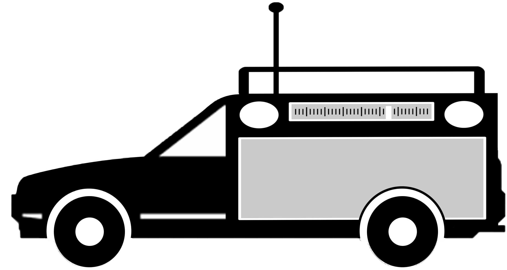
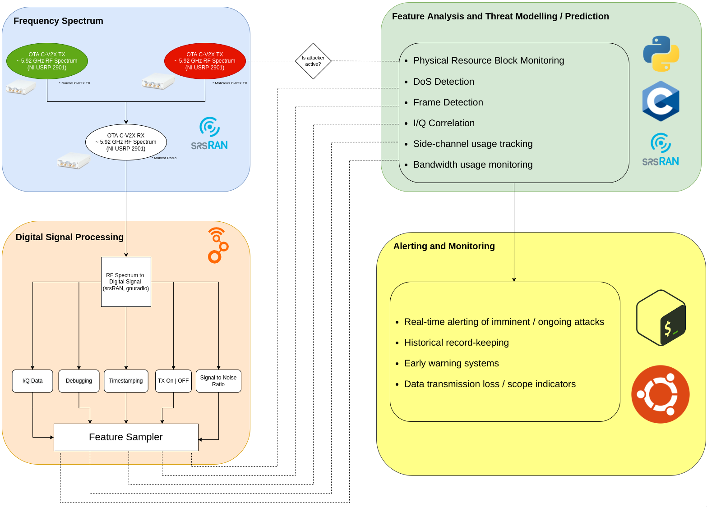

<h1 align="center">Engineering Addendum</h1>

<b>C-V2X Misbehavior Detection System</b>

<b>Team 13</b>

Michael Aliberti

Max Ellsworth

Jason  Inirio

Sam Krasnoff

Julia Zeng

Yixiu Zhu

 

## Navigation

<!-- TABLE OF CONTENTS -->

  
Table of Contents

  <ol>
    <li>
      <a href="#engineering-addendum">Title</a>
    </li>
    <li>
      <a href="#project-overview">Project Overview</a>
    </li>
    <li>
      <a href="#repositories">Repositories</a>
    </li>
    <li>
      <a href="#current-status">Current Status</a>
    </li>
    <li>
      <a href="#advice-for-future-custodians">Advice for Future Custodians</a>
    </li>
  </ol>

 

## Project Overview

The purpose of the C-V2X Misbehavior Detection System Project is to model Cellular Vehicle to Everything communication with software defined radios, to perform denial of service attacks on said communications with another radio, and ultimately to develop a radio-software system to detect said attacks.

To this end, we have used modified versions of the SrsRAN library as well as Fabian Eckerman's C-V2X Traffic Generator - the only readily available implementation of C-V2X on software-defined radios - to create a model of C-V2X traffic. We then used GNURadio and a modified version of a jammer provided by Worcester Polytechnic Institute in order to jam our C-V2X traffic. Finally, we created separate deep learning models to assess in-phase and quadrature data and resource block allocation data, which are two defining features of C-V2X traffic, in an effort to detect denial of service attacks.

 

The above image is a block diagram identifying the individual components of the C-V2X Misbehavior Detection System. The Frequency Spectrum block outlines the hardware setup; Digital Signal Processing is performed by SrsRAN, the C-V2X Traffic Generator, and GNURadio; and the final two blocks encapsulate data collection and machine learning for denial of service attack detection.

 

(<a href="#navigation">to table of contents</a>)

## Repositories

This project leverages multiple different repositories within the <a href="https://github.com/C-V2X-Senior-Design">C-V2X Senior Design Github Organization</a>. These include modified forks of existing radio software repositories, original repositories for machine learning model generation, and even a repository for discussing and tracking outstanding tasks.

Substantial repositories used throughout the project's lifecycle are listed below.

* <a href="https://github.com/C-V2X-Senior-Design/CV2X_MachineLearning">C-V2X Machine Learning</a>
  * A python based machine-learning suite designed to generate and evaluate misbehavior-detection models trained on resource block allocation data

* <a href="https://github.com/C-V2X-Senior-Design/cv2x-traffic-generator">C-V2X Traffic Generator</a>
  * A fork of Fabian Eckerman's <a href="https://github.com/FabianEckermann/cv2x-traffic-generator">Cellular Vehicle-to-Everything Traffic Generator</a> repository used in simulating and testing C-V2X traffic

* <a href="https://github.com/C-V2X-Senior-Design/gnuradioRX-Jamming">GNURadio RX Jammer</a>
  * A frequency-hopping jammer based on the work of WPI's Yaya Brown, linked <a href="https://digital.wpi.edu/concern/student_works/hm50tv580?locale=en">here</a>

* <a href="https://github.com/C-V2X-Senior-Design/MachineLearning_Yixiu">Machine Learning Yixiu</a>
  * A python based machine-learning suite designed to generate and evaluate misbehavior-detection models trained on I/Q data

* <a href="https://github.com/C-V2X-Senior-Design/modSrsRAN">ModSrsRAN</a>
  * A fork of the <a href="https://github.com/srsran/srsRAN">srsRAN</a> repository with added code to automate building, running, extracting radio metrics such as I/Q data and resource block allocation
  * Superseded by the C-V2X traffic generator code, which is more specific to the C-V2X protocol

* <a href="https://github.com/C-V2X-Senior-Design/TrackTasks">Track Tasks</a>
  * A repository containing Github issues regarding outstanding work and serving as a point of contact with client Stefan Gvozdenovic

 

(<a href="#navigation">to table of contents</a>)

## Current Status

Our software-defined radio setup and integration with desktop controllers is complete. We are currently using three NI 2901 USRPs attached to one of two desktop computers running the DragonOS (lubuntu) operating system. These USRPs are synchronized using either two Keysight 33500B Waveform Generators or a CDA-2990 8 Channel Clock Distribution Module. Functionality of the setup has been confirmed through extensive testing using the SrsRAN library's base station to user end examples.

C-V2X traffic is mostly functional, with transmissions appearing viable when examined in their raw form through programs such as GQRX. However, we have been unable to verify the holistic reception of C-V2X packets, as only sidelink control information (C-V2X metadata) is readable by our receiver while transport block information (C-V2X payload) is not. This may in part be due to our baseline in Fabian Eckerman's C-V2X Traffic Generator implementing an incomplete version of the C-V2X protocol by filling transport blocks with random data, though tests have been inconclusive.

Our GNURadio-based jammer is completely functional, and continuously hops frequencies along the C-V2X band. We were able to confirm the effectiveness of this jammer, as the sidelink control information from our C-V2X transmission scheme is received during normal operation, but is dropped when the jammer is active. Improvements to the jammer could be made by aligning it more with the C-V2X protocol, as jammers originally proposed by one of our clients, David Startobinski, transmit data identical to what is found in ordinary C-V2X transmissions.

Our detection scheme in the form of dual deep learning models has shown promise, but has yet to be tested on our own generated data due in part to the limitations discussed above. The resource-block based model has been trained using artificial data created by our team, while the I/Q-based model is trained using the <a href="https://www.deepsig.ai/datasets">RADIOML 2016.10A dataset</a>. These models provide a solid foundation for misbehavior detection and should be portable to different C-V2X communication libraries should they arise.

 

(<a href="#navigation">to table of contents</a>)

## Advice for Future Custodians

First and foremost, creating a C-V2X misbehavior detection system requires working C-V2X traffic generation, which in turn requires a well-formed implementation of the C-V2X protocol for software-defined radios. Unfortunately, due to the novelty of the protocol and the high cost of radios powerful enough to transmit in the required 5.92 GHz range, few such open source implementations exist. The only library we could find, Eckerman's C-V2X Traffic Generator, is by design not even a complete, faithful implementation of the protocol. Rather, it is a system designed to simulate multiple vehicles transmitting only the metadata required for C-V2X Modems to identify its traffic as valid, to the end of stress-testing modems (as outlined in Section two of <a href="https://ieeexplore.ieee.org/abstract/document/9449043">SDR-based Open-Source C-V2X Traffic Generator for Stress Testing Vehicular Communication</a>). As C-V2X gains more support in the future, more options will hopefully exist as far as software-defined radio implementations, but until then, it would be advisable to acquire a C-V2X modem to test any implementation of C-V2X transmitter and receiver against.

As far as the hardware setup, fully commit to the DragonOS operating system and an Octoclock or GPSDO module for synchronization from the start. We initially tried running DragonOS in virtual machines on our existing computers, but the demanding nature of radio software as well as difficulties in getting radio peripherals to communicate with the VMs made this unsustainable long-term. As far as synchronization is concerned, the Octoclock/GPSDO are simply more faithful to the C-V2X protocol and serve the same function as signal generators but with less overhead.

Location matters. All tests we have run and individuals with whom we have spoken have indicated that Photonics is a rather noisy building, radio-wise. While we were still able to execute simple transmissions examples via antenna, it is distinctly possible that the noise levels in the lower floors of Photonics may interfere with transmission examples or at the very least add undue noise to training data for the misbehavior detection models. It is therefore advised that the setup be placed somewhere with less radio activity.

Brainstorm how to parallelize this project early. Training misbehavior detection models is difficult when you don't yet have a working communication system or data therefrom, but there are many pre-existing, pre-labeled I/Q datasets available online to begin training on. Research is key, so having team members dedicate time to understanding the C-V2X protocol is a significant boon. Determine the right implementation of C-V2X for you (should more options become available) and verify communications within that protocol.

Finally, don't be discouraged. C-V2X is still a relatively new technology, and a lot of work in the field is proprietary. While there is a lot of overview and theory out there, actual implementations are scarce. The project is difficult, but rewarding, as you get to explore a piece of cutting edge technology alongside the world of software-defined radios. 

 

(<a href="#navigation">to table of contents</a>)

