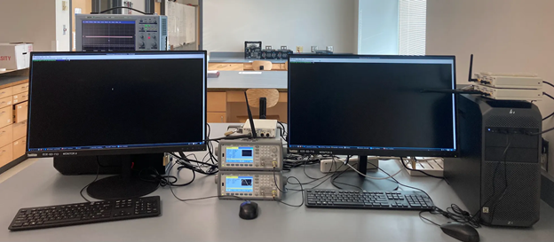

<h1 align="center">Hardware Report</h1>

<b>Team 13: C-V2X Misbehavior Detection System</b>

 

## Navigation

<!-- TABLE OF CONTENTS -->

  
Table of Contents

  <ol>
    <li>
      <a href="#software-report">Title</a>
    </li>
    <li>
      <a href="#overview">Overview</a>
    </li>
    <li>
      <a href="#bill-of-materials">Bill Of Materials</a>
    </li>
    <li>
      <a href="#data-sheets">Data Sheets</a>
    </li>
    <li>
      <a href="#lab-setup">Lab Setup</a>
    </li>
  </ol>

 

## Overview

Hardware sat at the heart of this project, as all the data created had to be analog. The three National Instruments software defined radios, or SDRs read in C code to trahslate function calls into configurations for the radio, such as the gain, FFT size, and frequency to broadcast at, among other capabilities. These served as the transmitter, reciever, and jammer for our mockup. To support and program these, we had two desktops with Dragon OS. This allowed us to not just have a consistant station to program the radios, but monitoring software such as GQRX to confirm signal stability and strength. The two Keysight signal generators made sure the radios had a precise pulse per second, or PPS for timekeeping, as well as a 10 MHz reference waveform to function as the clock for our V2X signal. The oscilloscope from LeCroy gave us the capibility to confirm the accuracy of the signals. Finally, the CDA 8 Channel Clock Distribution Module, or Octoclock for short, was later used for a more unified apporach for a GPS sync between the radios. Overall, each of these products were vital to delivering data over the air between radios.

 

(<a href="#navigation">to table of contents</a>)

## Bill Of Materials
<table>
    <tbody>
        <tr">
            <td colspan="1" rowspan="2">
                

                
No.

            </td>
            <td colspan="1" rowspan="2">
                

                
Project-related Device &amp; Materials

            </td>
            <td colspan="1" rowspan="2">
                

                
Manufacturer

            </td>
            <td colspan="2" rowspan="1">
                
Specs of Device &amp; Material

            </td>
            <td colspan="1" rowspan="2">
                

                
Total Cost ($)

            </td>
        </tr>
        <tr">
            <td colspan="1" rowspan="1">
                
Quantity 

            </td>
            <td colspan="1" rowspan="1">
                
Unit Cost ($)

            </td>
        </tr>
        <tr>
            <td colspan="1" rowspan="1">
                
1

            </td>
            <td colspan="1" rowspan="1">
                
CDA 2990 8 Channel Clock Distribution Module

            </td>
            <td colspan="1" rowspan="1">
                
National Instruments

            </td>
            <td colspan="1" rowspan="1">
                
1

            </td>
            <td colspan="1" rowspan="1">
                
2,866

            </td>
            <td colspan="1" rowspan="1">
                
2,866

            </td>
        </tr>
        <tr>
            <td colspan="1" rowspan="1">
                
2

            </td>
            <td colspan="1" rowspan="1">
                
Desktop with Dragon OS

            </td>
            <td colspan="1" rowspan="1">
                
Dell

            </td>
            <td colspan="1" rowspan="1">
                
2

            </td>
            <td colspan="1" rowspan="1">
                
Around 500

            </td>
            <td colspan="1" rowspan="1">
                
1,000

            </td>
        </tr>
        <tr>
            <td colspan="1" rowspan="1">
                
3

            </td>
            <td colspan="1" rowspan="1">
                
Keysight 33500B signal generator

            </td>
            <td colspan="1" rowspan="1">
                
Keysight Technologies

            </td>
            <td colspan="1" rowspan="1">
                
2

            </td>
            <td colspan="1" rowspan="1">
                
1,979

            </td>
            <td colspan="1" rowspan="1">
                
3,958

            </td>
        </tr>
        <tr>
            <td colspan="1" rowspan="1">
                
4

            </td>
            <td colspan="1" rowspan="1">
                
LeCroy Wavesurfer 422 Oscilloscope

            </td>
            <td colspan="1" rowspan="1">
                
Teledyne Lecroy

            </td>
            <td colspan="1" rowspan="1">
                
1

            </td>
            <td colspan="1" rowspan="1">
                
5,141

            </td>
            <td colspan="1" rowspan="1">
                
5,141

            </td>
        </tr>
        <tr>
            <td colspan="1" rowspan="1">
                
5

            </td>
            <td colspan="1" rowspan="1">
                
NI 2901 USRP (AFRL provided)

            </td>
            <td colspan="1" rowspan="1">
                
National Instruments

            </td>
            <td colspan="1" rowspan="1">
                
3

            </td>
            <td colspan="1" rowspan="1">
                
2,010

            </td>
            <td colspan="1" rowspan="1">
                
6,030

            </td>
        </tr>
        <tr>
            <td colspan="5" rowspan="1">
                
Total Cost

            </td>
            <td colspan="1" rowspan="1">
                
18,995

            </td>
        </tr>
    </tbody>
</table>

 

(<a href="#navigation">to table of contents</a>)

## Data Sheets

<table>
    <tbody>
        <tr">
            <td colspan="1" rowspan="1">
                
No.

            </td>
            <td colspan="1" rowspan="1">
                
Device

            </td>
            <td colspan="1" rowspan="1">
                
Datasheet

            </td>
        <tr>
            <td colspan="1" rowspan="1">
                
1

            </td>
            <td colspan="1" rowspan="1">
                
CDA 2990 8 Channel Clock Distribution Module

            </td>
            <td colspan="1" rowspan="1">
                
<a href="https://www.ni.com/pdf/dspdf/en/ds-572">link</a>

            </td>
        </tr>
        <tr>
            <td colspan="1" rowspan="1">
                
2

            </td>
            <td colspan="1" rowspan="1">
                
Desktop with Dragon OS

            </td>
            <td colspan="1" rowspan="1">
                
N/A<a href="https://www.youtube.com/watch?v=dQw4w9WgXcQ">.</a>

            </td>
        </tr>
        <tr>
            <td colspan="1" rowspan="1">
                
3

            </td>
            <td colspan="1" rowspan="1">
                
Keysight 33500B signal generator

            </td>
            <td colspan="1" rowspan="1">
                
<a href="https://www.keysight.com/us/en/assets/7018-05928/data-sheets/5992-2572.pdf">link</a>

            </td>
        </tr>
        <tr>
            <td colspan="1" rowspan="1">
                
4

            </td>
            <td colspan="1" rowspan="1">
                
LeCroy Wavesurfer 422 Oscilloscope

            </td>
            <td colspan="1" rowspan="1">
                
<a href="https://cdn.teledynelecroy.com/files/manuals/ws-om-e_rev_b.pdf">link</a>

            </td>
        </tr>
        <tr>
            <td colspan="1" rowspan="1">
                
5

            </td>
            <td colspan="1" rowspan="1">
                
NI 2901 USRP (AFRL provided)

            </td>
            <td colspan="1" rowspan="1">
                
<a href="https://www.ni.com/pdf/manuals/374925c.pdf">link</a>

            </td>
        </tr>
    </tbody>
</table>

 

(<a href="#navigation">to table of contents</a>)

                                        
## Lab Setup

Above are the devices described in the overview. Two desktops, with the one on the left behind the monitor. The two signal generators are located in the middle, with one SDR on top. The other two radios are stacked on top of one another on the right desktop. Finally, the Oscilloscope is behind the left monitor.

### Setup Procedure
                                        
Perform the following steps to set up USRPs for communication
                                        
* Connect each USRP to separate power sources and computers.
  * You can ensure these USRPs have been properly connected and are visible to the computer by running  `uhd_find_devices` on the command-line of the connected PC.
* Connect each USRP to one of the following:
  * Two signal generators connected to the same relative inputs on each USRP with the following settings:
    * A “Pulse, Off, 50 Ohm” wave which is “AM modulated by sine”, frequency of 1 Hertz, amplitude of 10 dBm
    * A “Square, Off, 50 Ohm” wave which is “AM modulated by sine”, frequency of 10 Megahertz, amplitude of 100 millivolts (this should probably be 10 dBm)
  * The GPS output of the 8 channel clock distribution module
* Enable communication between USRPs by doing one of the following:
  * Attaching antennae to the transmit and receive inputs of each USRP
  * Connect the transmit input of each USRP to the receive inputs of all other USRPs via cable, using wire splitters if necessary
                                        
Now, use software such as GQRX and SrsRAN to confirm that your radios are communicating.

 

(<a href="#navigation">to table of contents</a>)

